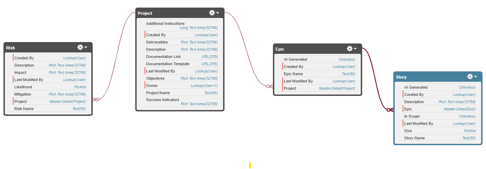
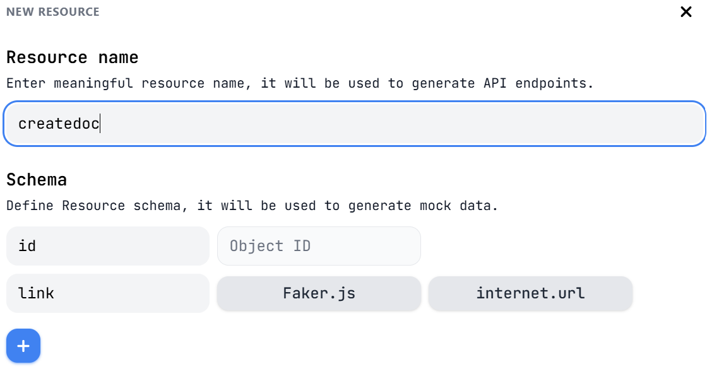

  

## Introduction

  

Welcome to the Agentforce Workshop! This workshop was created for Midwest Dreamin 25, you can check the presentation [here](deck/MWD25%20-%20Extend%20Agentforce%20with%20Custom%20Actions.pdf).

  

In this workshop, we will create an App called Briefly that will use Agentforce to assist Admins, Business Analyst an really anyone who is tasked with documenting projects!

  

Briefly is intended to help and ease requirements gathering and project documentation and while it’s built on Salesforce, you don’t need to use it for work related purposes only. Organizing a birthday party? Maybe planning a trip through Europe? Why not use Briefly to put the stories together?

  

Important Note: The solution and code provided is not considered production ready, please use it for learning purposes.

  

## Prerequisites

  

To complete this workshop you will need:

  

  

- A Salesforce developer org with Agentforce (See Level 1 for further instructions)

- A [mockapi.io](http://mockapi.io) account

- To complete the Bonus Level you will need:

  

- A Free Make account

- A Google Account

  

## Level 1 - Setup (15 minutes)

  

### Step 1 - Get a developer org (optional)

  

  

For this workshop you will need a Salesforce org with Agentforce enabled. If you have an org already you can skip this step.

  

  

If you don’t have an org with Agentforce, sign up for one here: [https://www.salesforce.com/form/developer-signup/](https://www.salesforce.com/form/developer-signup/)

  

  

### Step 2 - Install the Briefly package

  

  

Visit the following URL and install the Briefly App to all users: [https://login.salesforce.com/packaging/installPackage.apexp?p0=04tfL000000K1xd&isdtp=p1](https://login.salesforce.com/packaging/installPackage.apexp?p0=04tfL000000K1xd&isdtp=p1)

  

  

This package contains the custom objects and app that we will use for our solution, this is the data model that will support our App:

  

  

  

  

### Step 3 - Enable Agentforce

  

  

You can skip this step if you already have an org with Agentforce enabled.

  

  

1. Navigate to **Setup**, **Quick Find** and navigate to **Einstein Setup**.

2. Enable the **Turn on Einstein** checkbox.

3. Refresh your browser

4. Search for **Agentforce Agents** in the Quick Find bar

5. Enable the **Agentforce** checkbox on the far right side

6. Click on the **Enable the Agentforce (Default) Agent** checkbox

  

  

You should now be all set to start building with Agentforce!

  

  

### Step 4 - Setup your Mock service

  

  

Our Agent is going to take care of creating our project documentation for us. For the purposes of this workshop, we are going to create a mock third party service that will do this but if you would like to do an actual implementation of this check out the Bonus Level section!

  

  

- Visit [https://mockapi.io/projects](https://mockapi.io/projects)

- Click on **Get Started** and create your account

- Create a new Project and call it: Briefly

- Click on your project name and then click on **New resource**

- Remove all the fields from the Schema and add just one called link, see the screenshot below for reference:

  

  

- Name your resource **createdoc**

- Copy the URL of your mock api resource, you will need this for Level 5!

  

Let’s authorize this URL so it can be called by our Apex Class.

  

- Go to Setup and search for **Remote Site Settings** in the Quick Find bar

- Click **New Remote Site**

- Name your site mockApi

- Enter the copied URL in the Remote Site URL field and click on Save.

  

### Step 5 - Create a test project

  

  

In order to be able to perform and test some of the features of this project we will need some test data.

  

- Access the Briefly App by going to the App Launcher and searching for **Briefly**.

- Create a new Project, and add at least two Epics with Two Stories each.

- If you can’t think of something at the moment, you can use the sample data below:

  

**Project Name**: Marketing Cloud Refer a Friend campaign.

**Description**: This project is the development of a refer a friend campaign developed in Marketing Cloud.

**Objectives**: Encourage users to refer friends in order to get incentives for them and their friends.

**Deliverables**:

- Refer a friend journeys with landing page to refer a friend and up to 2 reminder emails.

- One test version of the journey deployed in the test business unit in marketing cloud engagement

- One live version of the journey deployed in the production version of the business unit |

  

**Epics and Stories**:

  

**Epic 1:** Refer a Friend Journey Development

**Stories:**

  

-  **Story Name:** Journey Design

-  **Description:** The Marketing and IT teams will collaboratively design the refer a friend journey in Marketing Cloud, ensuring it aligns with the project objectives and feeds data from a Salesforce Campaign into Journey Builder.

-  **Story Name:** Journey Approval

-  **Description:** The designed journey will be presented to the executive team for approval before moving into development.

  

**Epic 2:** Landing Page and Reminder Emails Creation

  

-  **Story Name:** Landing Page Development

-  **Description:** The Creative and IT teams will work together to develop a landing page where users can refer their friends.

-  **Story Name:** Reminder Emails Development

-  **Description:** The Creative and Marketing teams will develop up to 2 reminder emails to engage users in the refer a friend journey.

  

## Level 2 - Creating a Prompt Template (10 minutes)

  

  

We are going to configure our Agent to help us complete Success Indicators for our project based on the project information, for this we are going to utilize a field generation Prompt Template.

  

  

### Step 1 - Create the Prompt Template

  

  

- Navigate to Setup and search for **Prompt Builder** in the Quick Find box

- Click on **New Prompt Template**

- Select **Field Generation** for Prompt Template Type

- For name enter: Briefly - Complete Success Indicators

- For Description enter: Provides success indicators for a project based on its details

- For Object select the Project__c Object and for Field select the SuccessIndicators__c field

- Click **Next**

- Enter the following for the Prompt:

  

> You are a business analyst working at {!$Organization.Name}. Your role is to provide clear and concise Success Indicators for the project that will make it clear to the team what success looks like.
>
> Here are the project details:
>
>  - Project Description: {!$Input:Project__c.Description__c}
>
>  - Objectives: {!$Input:Project__c.Objectives__c}
>
>  - Key Deliverables: {!$Input:Project__c.Deliverables__c}
>
>  - Epics: {!$RelatedList:Project__c.Epics__r.Records}
>
>  - Risks: {!$RelatedList:Project__c.Risks__r.Records}
>
> With this information Provide a bulleted list of 3-5 Success Indicators that are clear based on the project detailed information.
 
- Click on Save and then Activate

  

  

### Step 2 - Testing our Prompt Template

  

  

- Within the Prompt Template window you are in, click on the **Preview** button

- Select the existing project you created in Level 1 and click **Preview** again

- Review the response of the prompt template and adjust it if necessary (you will need to Save the template as a new version)

  

  

### Step 3 - Assign the Field Generation Template to our field

  

  

- In Setup, navigate to **Object Manager**

- Search for our Project object

- Click on **Lightning Record Pages** and click on **Project Record Page**

- Click edit to open the Page Builder

- Click on the details pane and on the **Upgrade Now** button that’s located on the right, see this image for reference: 

- Click **Next**, select Project Page Layout and then **Finish**

- Once updated, select the Success Indicators field and on the right hand side panel you will be able to find and choose our newly created field generation template! See image below for reference: 

- Click Save, you can exit for now, we will test our Field Generation Prompt Template later

  

## Level 3 - Creating a Flow Custom Action (15 minutes)

  

  

Now that we’ve created our Agent, we have to create some actions to choose from and execute.

  

  

### Step 1 - Creating a Flow Custom Action

  

  

This custom action will allow us to create Epics and Stories when we request it to the Agent.

  

  

- Navigate to *Setup - Process Automation - Flows*

- Click *New Flow* and Select *Autolaunched* and then *Autolaunched Flow (No Trigger)*

- Open the Toolbox panel, by clicking on this icon on the left area of the page:

- Click *New Resource*

  

We are going to need several variables to use in our Flow, follow the table below to create all variables:

  

| Name | Description | Data Type | Available for input | Available for output |
| --- | --- | --- | --- | --- |
| epicId | The ID of the epic | Text | No | No |
| projectId | The Id of the existing project | Text | Yes | No |
| epicTitle | The title for the new epic to be created or updated | Text | Yes | No |
| storyDescription | The description of the story to be created | Text | Yes | No |
| storyName | The name of the story to be created | Text | Yes | No |
| storySize | The size of the story to be created | Text | Yes | No |
| storyId | The Id of the newly created story | Text | No | Yes |

  

If you are proficient at Flow, what we want to create is a Flow that retrieves an Epic record by Title, if the Epic is not found, create it and assign the value to the epicId variable. Then, it will create a Story record with all the variables we created and assign the storyId variable at the end.

  

  

Here’s an image of the Flow you will recreate:

  

  

  

  

If you need more detailed instructions on creating this Flow follow the steps below, otherwise jump into step 2

  

  

Add the following elements to your flow and copy the screenshots for configuration details:

  

  

**1. Add a Get Records element**

  

  

  

  

**2. Add a Decision element**

  

  

  

  

**3. For the Yes Path, add an Assignment Element**

  

  

  

  

**4. For the Default Outcome Path, add a Create Records Element**

  

  

  

  

**5. For the Default Outcome Path, add an Assignment Element**

  

  

  

  

**6. Back to the main path! Add a Create Records Element**

  

  

  

  

**7. Add a final Assignment Element**

  

  

  

  

### Step 2 - Save and Activate the Flow

  

  

- Save the Flow, name it Briefly - Create Story and add the following description: Creates a new Epic and Story given a projectId and the parameters to find an Epic by Title if not found or create a new one and create a new Story.

- Click **Save** - Click **Activate**

  

  

## Level 4 - Creating an Apex Custom Action (10 minutes)

  

  

Ok, as you can tell by now we are increasing our complexity little by little.

  

  

We want our Agent to create the documentation associated with our Project so we can share it with our team.

  

  

For this we will need to connect to a third party service so we will create an Apex Class with an invocable method.

  

  

### Step 1 - Create Apex Class

  

  

- Open the Developer Console by clicking on the Gear on the top far right and then clicking on **Developer Console**

- Click on **File - New - Apex Class**

- Let’s name our Class BrieflyDocumentationGenerator

- Replace the code of your new Class with the code located in this repository located at sfdc/BrieflyDocumentationGenerator.cls

- Replace the URL located in line 95 of the class with the mock api service you created in Level 1-step 4. It should read something similar to: [https://68724eea76a5723aacd44399.mockapi.io/createdoc](https://68724eea76a5723aacd44399.mockapi.io/createdoc)

- Save your class and close the developer console

  

## Final Level - Putting it all together! (15 minutes)

  

Now that we have all the components for our project helper Agent we are going to configure and test our Agent.

  

  

### Step 1 - Modify the Default Agent

  

  

- Navigate to **Setup - Agentforce Studio - Agentforce Agents**

- Click on the **Agentforce (Default)** Agent

- Edit the Description to read: *Assist teams by creating Epics, Stories and Risks, associating them to a Project in the Briefly application, and providing insights or suggestions about the written stories.*

- Edit the Role to read: *You are an Agentforce employee Agent whose job is to help business analysts, project owners and others create and manage Epics, Stories and Risks in the Briefly application, and provide insights to enhance story creation.*

- Company: Put the name of your company or come up with one

- Click Save

  

  

### Step 2 - Creating a new Topic for our Agent

  

  

- Within the Default Agentforce window and click on **Open in Builder**

- On the Topic panel click on **New - New Topic**

- Click **Next**

- Complete the following details for the Topic:

	- **Name:** Epics and Stories Creation
	- **Classification Description:** Guide the creation of Epics and Stories for a given project. Assist users in defining and structuring their project tasks.
	- **Scope:** Your job is only to assist users in creating Epics and Stories by providing guidance on structuring and defining project tasks. Do not handle other project management tasks.
	- **Instructions (add one instruction pero text box):**
		- Advise users to break down the project into smaller, manageable stories and group them under relevant Epics.
		- Always provide the id of the project when calling Briefly_Create_Story.
		- Before creating a epic or a story for a project, ask the user to confirm this action.
		- Gather detailed information from the user about the project's objectives and requirements before creating Epics and Stories.
		- If a user is unsure about how to start, suggest they begin by defining the overall goal of the project.
		- If the user asks to provide ideas for stories or epics, always provide epics and stories that don't already exists in the project, call QueryRecords if you need to pull details about epics and stories for a project.
		- If you need the ID of the project, ask for the project Name and call IdentifyRecordByName to retrieve the ID of the project by name.
		- Offer examples of well-defined Epics and Stories to help users understand the structure.
		- When a user ask, provide them with risks associated with the existing Epics and Stories for a given project.
		- Ask the user if they would like to create the Epics and Stories you suggested, if they confirm, call Briefly_Create_Story and always provide the project ID, EpicName, StoryTitle, StoryDescription and Story Size for each Epic and Story.
		- When calling Briefly_Create_Story alway pass storySize one of these possible values: S,M,L. S equals within one sprint, M is more than one sprint, L is more than two sprints.
		- When the user asks to generate the documentation for the project call Generate_Project_Documentation and return the documentation url generated.
		- When the user asks to add stories or epics to the project, always check that the stories do not exist already in the project.
		- Don't provide ideas for Epics or Stories for a project that does not exist or could not be found, instead ask the user to create the project first.

  

  

- Click **Next**

- Search and select the following Actions to the Topic:

  

	- Identify Object by Name

	- Query Records

	- Summarize Record

  

- Click **Finish**

  

  

### Step 3 - Adding custom actions to our Topic

  

  

Now that we have the foundation of our Topic we need to add the two custom actions we created.

  

  

- First, let’s go ahead and remove the General CRM and Single Record Summary Topics by click on the arrow next to them and then *Remove from Agent*

- Now click on your newly created Topic

- Click on the *This Topic’s Actions* tab

- Click New - Create New Action

- For *Reference Action Type* select Flow

- For Reference Action select: Briefly - Create Story

- Click *Next*

- For loading text enter anything to your liking for example: Creating stories…

- Click *Finish*

- Add another Action this time the Reference Action Type will be Apex and the Reference Action will be Invocable Method

- Select *Generate_Project_Documentation*

- Click *Next*

- For loading text enter anything to your liking for example: Generating documentation…

- Make sure all the instructions fields are completed for each input and output:

	- ProjectIds: The ID of the project

	- linkURL: The URL of the generated documentation.

	- projectId: The ID of the project for which documentation was generated.

	- Response: The response from the HTTP POST request.

- Make sure that the linkURL field’s checkbox for *Show in conversation* is checked

- Make sure that the projectIds field’s checkbox for *Require input* is checked

- Click *Finish*

  

  

### Step 4 - Testing and activating the Agent!

  

  

Now that you have everything in place, you can start chatting with the Agent in Agentforce Builder and see in the middle pane how the Agent builds the action plan and executes actions.

  

  

Try asking things like: “can you help me create stories for my project?” and the Agent should ask you to provide a Project Name; or try asking the Agent to give you ideas for Stories and the Agent will offer to create these stories to your Project. You can then verify if the stories were created in the Briefly App!

  

  

Lastly, if you ask the Agent to generate documentation for your project you will see that the Agent will execute the Apex Invocable method and return a URL that the mock api will produce.

  

  

Once you are satisfied with the results, you can click on *Activate* to activate your Agent!

  

  

Now visit your Briefly app and click on the Agentforce icon on the top right to interact with the Briefly Agent.

  

  

Lastly, try the Field Generation Prompt Template we created in Level 3 by navigating to an existing project, editing the Success Indicators field and clicking on the button that’s next to the field. This should open up a window with suggestions on success indicators that you can use.

  

  

## BONUS LEVEL - Create the project documentation using Make

  

  

Make is a great process automation tool that allows you to automate tasks integration with multiple systems and create webhooks to invoke them.

  

  

Because they offer a Free tier and it's easy to set up, we will use it for our workshop.

  

  

- Visit [make.com](http://make.com)

- Sign up for a new account and answer a few questions

- Once in the home screen, navigate to *Scenarios* on the left hand side and click on *New Scenario*

- At the bottom of the screen you will see three dots, click then and choose *Import Blueprint*

- Upload the JSON file located here /make/Integration Webhooks, Google Docs.blueprint.json, this has a template I’ve created to create the documentation

- Click *Save*

- Click on the *Google Docs* element and connect your Google Account, remember this is the account where your documents will be stored.

- Click on the first Webhook element

- Click on *Create Webhook*

- Click on *Copy Address to Clipboard* and store this address somewhere

- Click on *Save*

- Click on the Save icon at the bottom of the Screen.

- Go back to the main *Scenarios* screen.

- Click on the checkbox next to the scenario to turn it on and start receiving calls!

- Going back to Salesforce, open the *Developer Console* by clicking on the Gear on the top far right and then clicking on Developer Console

- Open the class you created in Level 4 BrieflyDocumentationGenerator

- Replace the URL located in line 95 of the class with the URL that you got from Make.

- Save your class and close the developer console.

- Go to Setup and search for **Remote Site Settings** in the Quick Find bar

- Click **New Remote Site**

- Name your site make

- Enter the copied URL in the Remote Site URL field and click on Save.

- Test your Agent and ask it to generate the documentation for your project, you should now see a Google doc with documentation in your Google Drive!

  

  

## Thank you!

  

  

I hope this guide will help you understand how to integrate Agentforce with other services using Prompt Builder and Custom Actions, if you have any questions or feedback don't hesitate to contact me via [LinkedIn](https://www.linkedin.com/in/patosapir).

  

Thanks!